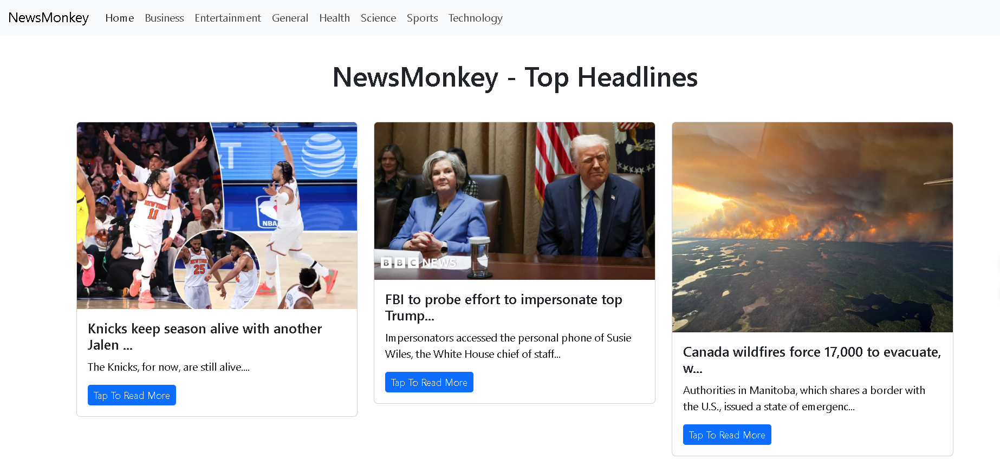

# 📰 NewsMonkey - Real-time News Aggregator

A modern, responsive news application built with React that brings you the latest headlines from around the world. NewsMonkey provides real-time news updates with a clean and intuitive user interface.



## ✨ Features

- 📰 Real-time news updates from multiple categories
- 🌍 Country-specific news filtering
- 📱 Responsive design for all devices
- ⚡ Dynamic pagination
- 🎯 Clean and intuitive user interface
- 🔄 Loading states with spinner
- 📊 Category-wise news filtering

## 🛠️ Tech Stack

- React.js
- NewsAPI Integration
- Bootstrap
- Modern JavaScript (ES6+)
- PropTypes for type checking

## 🚀 Getting Started

### Prerequisites

- Node.js (v14.0.0 or higher)
- npm or yarn
- NewsAPI API key

### Installation

1. Clone the repository

```bash
git clone https://github.com/pragyanshu-kashyap/Newsapp
cd Newsapp
```

2. Install dependencies

```bash
npm install
# or
yarn install
```

3. Create a `.env` file in the root directory and add your NewsAPI key:

```
REACT_APP_NEWS_API_KEY=your_api_key_here
```

4. Start the development server

```bash
npm start
# or
yarn start
```

The application will be available at `http://localhost:3000`

## 📦 Project Structure

```
src/
├── components/
│   ├── News.js
│   ├── NewsItem.js
│   └── Spinner.js
├── App.js
└── index.js
```

## 🔑 API Configuration

This project uses the NewsAPI. You'll need to:

1. Sign up at [NewsAPI](https://newsapi.org/)
2. Get your API key
3. Add it to your `.env` file

## 🎯 Features in Detail

### News Categories

- General
- Business
- Entertainment
- Health
- Science
- Sports
- Technology

### Pagination

- Dynamic page navigation
- Previous/Next buttons
- Page size customization

### Responsive Design

- Mobile-first approach
- Bootstrap grid system
- Adaptive layouts

## 🤝 Contributing

Contributions are welcome! Please feel free to submit a Pull Request.

1. Fork the project
2. Create your feature branch (`git checkout -b feature/AmazingFeature`)
3. Commit your changes (`git commit -m 'Add some AmazingFeature'`)
4. Push to the branch (`git push origin feature/AmazingFeature`)
5. Open a Pull Request

## 📝 License

This project is licensed under the MIT License - see the [LICENSE](LICENSE) file for details.

## 👨‍💻 Author

Your Name

- GitHub: [pragyasnhu-kashyap](https://github.com/pragyanshu-kashyap)
- LinkedIn: [https://www.linkedin.com/in/pragyanshu-kashyap/]

## 🙏 Acknowledgments

- [NewsAPI](https://newsapi.org/) for providing the news data
- [React](https://reactjs.org/) for the amazing framework
- [Bootstrap](https://getbootstrap.com/) for the styling framework

## 📞 Contact

Your Name - [Pragyanshu Kashyap](https://www.linkedin.com/in/pragyanshu-kashyap/)
Project Link: [https://github.com/pragyanshu-kashyap/Newsapp](https://github.com/pragyanshu-kashyap/Newsapp)
